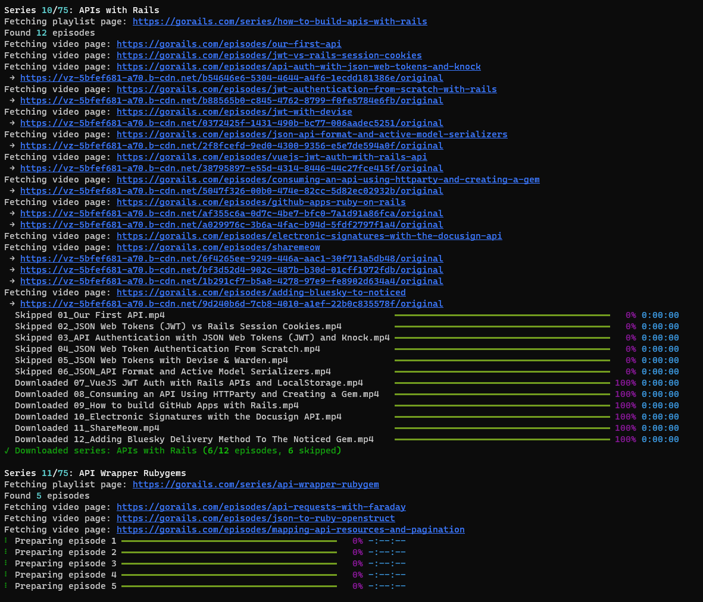

# GoRails Video Downloader

A minimal Python tool to download videos from the GoRails video series.



## Features

- Download single videos from GoRails
- Download entire playlists
- Download all series (each series/playlist in its own subdirectory)
- Authentication support (username/password or session cookie)
- Session persistence in user's home directory
- Manual HTML parsing to find download links
- Beautiful CLI interface with progress indicators
- Configurable output directory
- Direct CDN video downloads

## Installation

1. Clone or download this repository
2. Install the required dependencies:

```bash
pip install -r requirements.txt
```

## Usage

### Download a single video

```bash
python gorails_downloader.py video "https://gorails.com/episodes/your-video-url"
```

### Download a playlist

```bash
python gorails_downloader.py playlist "https://gorails.com/series/your-series-url"
```

### Download all series

```bash
python gorails_downloader.py all-series
```
This will download every series/playlist from GoRails, saving each one in its own subdirectory under the output directory.

### Specify custom output directory

```bash
python gorails_downloader.py --output-dir /path/to/downloads video "https://gorails.com/episodes/your-video-url"
```

### Manage authentication

```bash
python gorails_downloader.py auth
```

### Show help and information

```bash
python gorails_downloader.py info
python gorails_downloader.py --help
python gorails_downloader.py all-series         # Download all series
```

## Examples

```bash
# Download a specific episode
python gorails_downloader.py video "https://gorails.com/episodes/rails-7-hotwire-turbo-streams"

# Download an entire series
python gorails_downloader.py playlist "https://gorails.com/series/rails-7-hotwire"

# Download all series (each series in its own folder)
python gorails_downloader.py all-series

# Download to a custom directory
python gorails_downloader.py -o ~/Videos/GoRails video "https://gorails.com/episodes/rails-7-hotwire-turbo-streams"

# Manage authentication
python gorails_downloader.py auth
```

## Output

Videos are downloaded to the `downloads` directory (or your specified output directory) with the following naming convention:
- `{title}.mp4` - Uses the video title as filename (sanitized for filesystem compatibility)

When using the all-series command, each series is downloaded into its own subdirectory inside the output directory.

The tool parses GoRails HTML pages to find download links and follows redirects to get direct CDN URLs.

## Authentication

**Important**: This tool requires a valid GoRails **paid account**. Free accounts will not work as they don't have access to video downloads.

GoRails requires authentication to download videos. The tool supports three authentication methods:

1. **Email and Password**: Enter your GoRails paid account credentials (fully implemented)
2. **Session Cookie**: Provide the `_gorails_session` cookie value from your browser (must be from a paid account)
3. **Saved Session**: Use a previously saved session from `~/.gorails.json`

The session is automatically saved to `~/.gorails.json` for future use.

## Requirements

- Python 3.7+
- requests
- click
- rich
- beautifulsoup4
- lxml

## License

This project is for educational purposes. Please respect GoRails' terms of service and only download content you have permission to access. You must have a valid paid GoRails subscription to use this tool. 